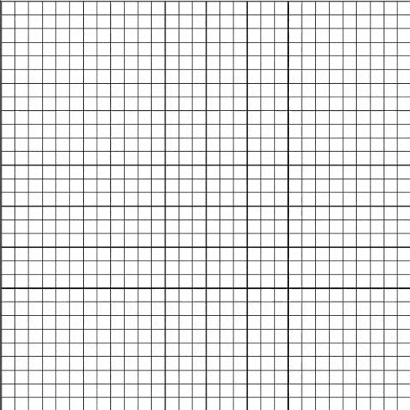

# Astar algorithme with visualisation 
  

## Requirements
- **Python 3.6+**, **pip**

## Installation
`pip install --user -r requirements.txt`

## Usage
`python main.py [-h] [--disable-diagonal] [--random-maze] [--maze-size MAZE_SIZE [MAZE_SIZE ...]] [--save-maze] [-o output] [mazefile]`
 
A simple `python main.py` will open a map creator. 
If you use the map creator, first clic to define start, second for end and then you can draw the walls. Press spacebar to run.

